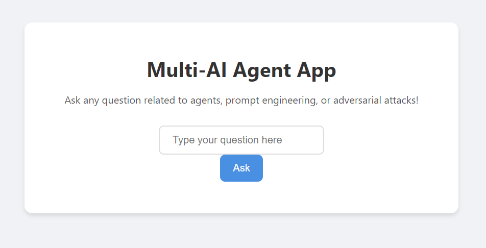
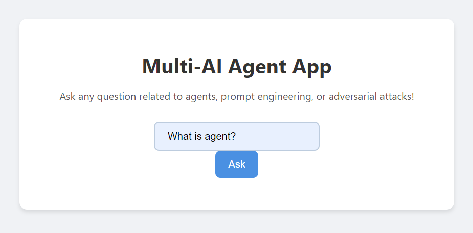
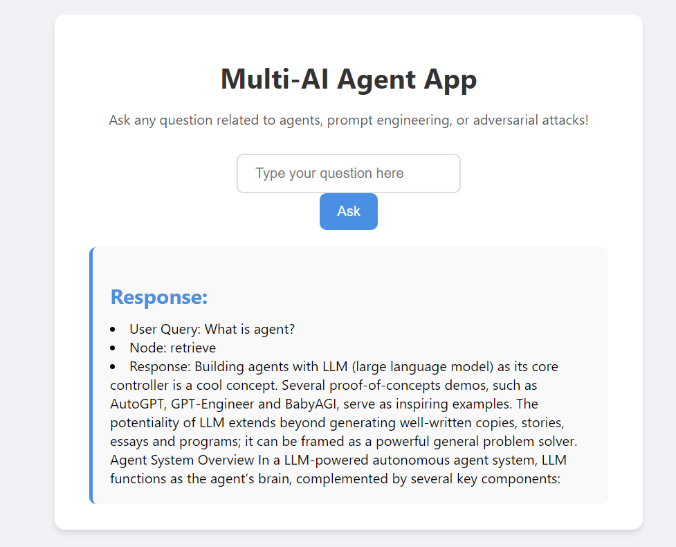
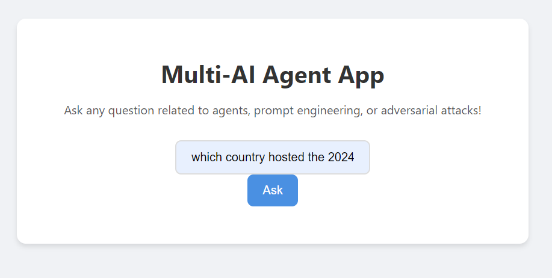
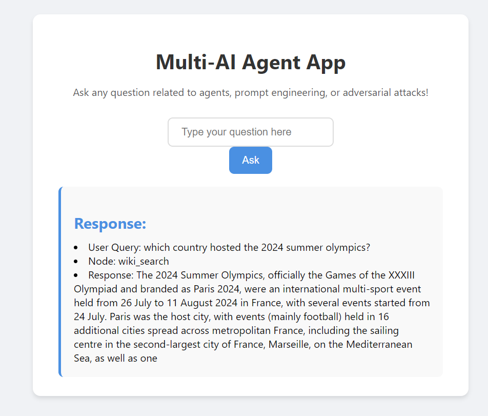

Image 1: Represents the developed user interface, showcasing the design and layout.

Image 2: User Quer 1.

Image 3: First searches the vector database using FAISS for relevant documents.

Image 4: User Quer 2.

Image 5: If the query can't be answered from the vector store, it then routes the request to Wikipedia using an API wrapper for additional information.

 
This project involves the development of a multi-AI agent web application that leverages Retrieval-Augmented Generation (RAG) and Agent technologies. The application is designed to provide users with an interactive platform for asking questions related to agents, prompt engineering, and adversarial attacks.
 
The workflow is designed to first search the vector database using FAISS for relevant documents. If the query can't be answered from the vector store, it then routes the request to Wikipedia using an API wrapper for additional information. The HuggingFace embeddings are used for document vectorization, and multiple agents are structured to handle the query processing and routing.
 
 
<strong>Key Components</strong> 

<strong>Frontend Development:</strong>
1. An HTML interface facilitates user queries, featuring an input box for questions, a submission button, and a dedicated area for displaying responses. 
2. CSS styling enhances the user experience, ensuring a visually appealing and responsive layout. 

<strong>Backend Development:</strong>
1. The Flask application serves the HTML template and processes POST requests, handling user inputs and fetching relevant responses. 
2. The backend communicates with a workflow to retrieve information and return structured responses for rendering on the frontend. 
   
<strong>Workflow Logic:</strong>
1. RAG is implemented using a vector store for efficient document retrieval based on user queries. 
2. An agent component routes questions to appropriate data sources, such as the vector store or external APIs, ensuring accurate responses. 
3. Integration of embeddings aids in enhancing retrieval effectiveness.
